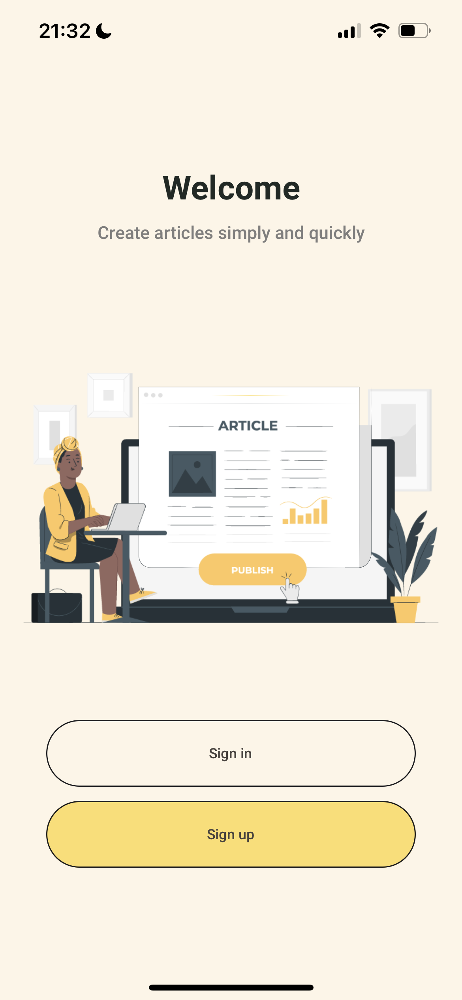
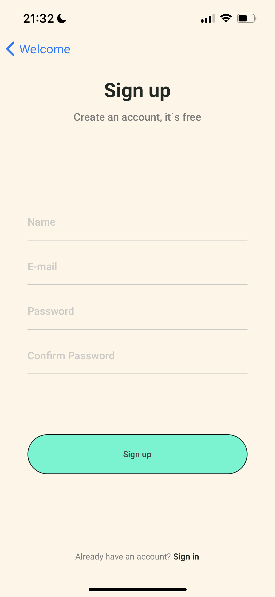
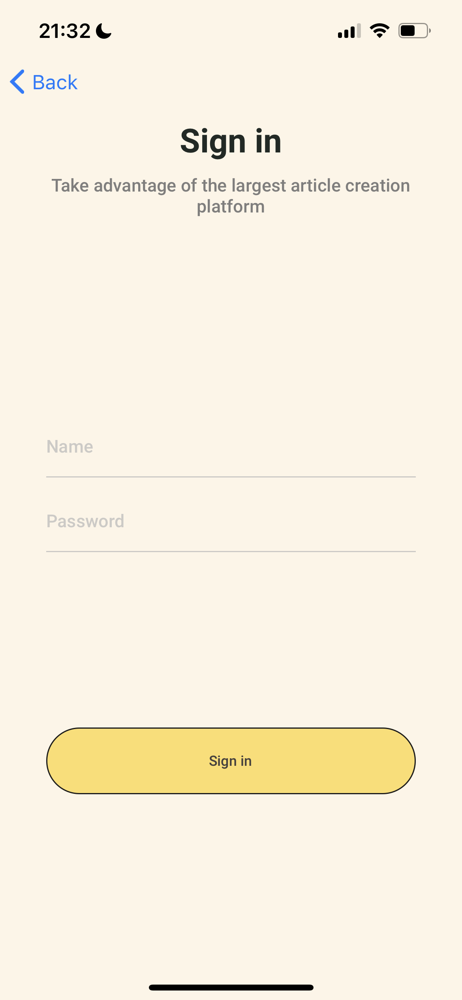
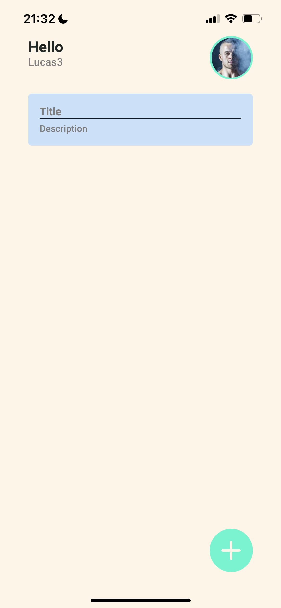
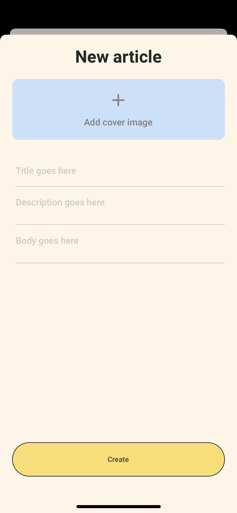
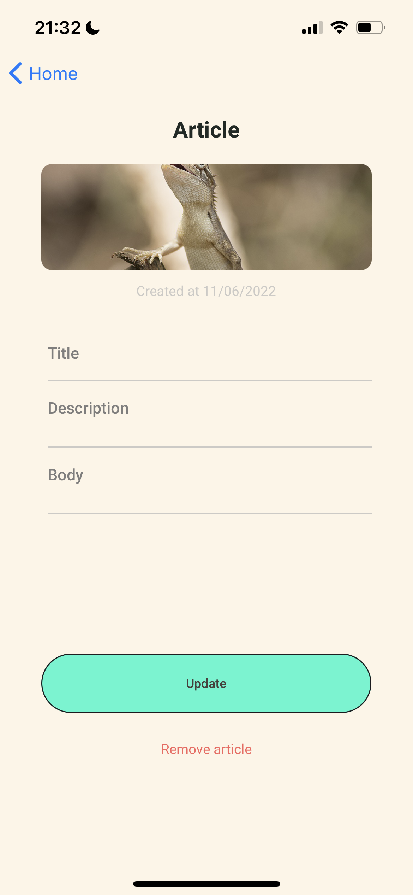
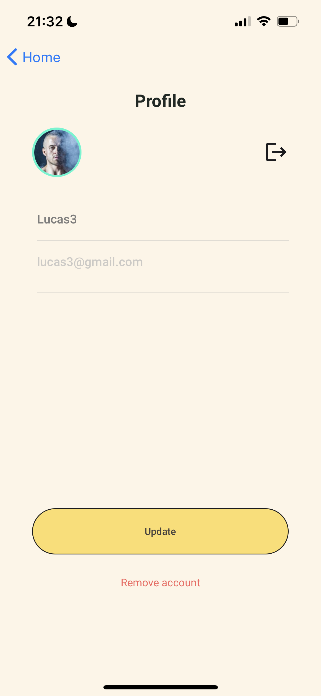

<div align="center">
  
</div>

</br>

# App para gerenciamentos de artigos

### Foi desenvolvido especialmente para empresa atom6, um CRUD de artigos, e um cadastra de usuário.

### A linguagem utilizada na aplicação foi o typescript, para estilização styled components.

### Foi utilizado useContext para gerenciamento do estado global e para comunicação com o backend foi utilizado o axios.

</br>

## Passos para iniciar o projeto:

```
yarn install
```

```
yarn start
```

```
yarn run android / yarn run ion
```

</br>

<p>

 





</p>

</br>

## Tecnologias :rocket:

- [React native](https://reactnative.dev/)
- [Typescript](https://www.typescriptlang.org)
- [styled-components](https://www.styled-components.com/)

Made with ♥ by Lucas Aguiar :wave: [Get in touch!](https://www.linkedin.com/in/lucasaguiiar)
